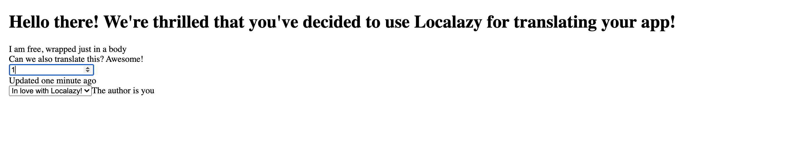

# angular-i18n-example


This is an example repository showing how to use Localazy with angular-i18n for localization management.
To learn more, check out the [blog post](https://localazy.com/blog/localize-angular-app-i18n-l10n-localazy) describing the set up in detail.

## Sandbox
Subject to be added.

First install dependencies
```shell
npm install
```

and then run the application
```shell
ng serve
```

## Adjusting for your own project

- sign up for [Localazy](https://localazy.com/register),
- [create an app](https://localazy.com/my/create). Although English is recommended, you may use any language as source 
- select *Angular* integration option and install Localazy [CLI](https://localazy.com/docs/cli/installation),
- Retrieve your _writeKey_ and _readKey_ from the integration guide page and change them in `localazy.keys.json`,
- it is recommended to add `localazy.keys.json` to _.gitignore_
- prepare template(s) for internationalization
- export source language XLIFF file
- run `localazy upload`,
- when you have accepted strings in other languages, run `localazy download` and check locales folder for the new translations,
-  run the app `ng serve`
